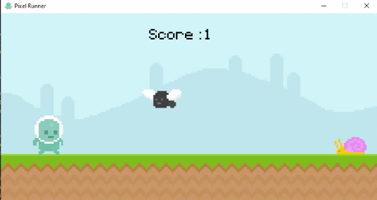
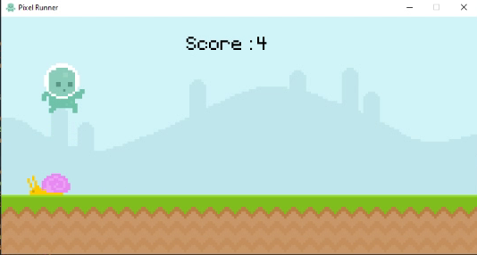
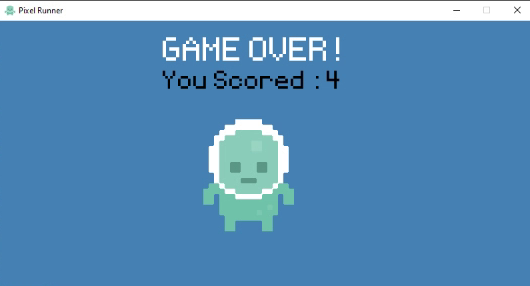

# 🎮 Pixel-Runner-game-using-Python
I made a Pixel Runner game using the pygame module Python

## `How to play`

1. Open the "main.py" file using your IDE
2. Run the Code
3. Play

## `Controls`

1. Press "Spacebar" to Jump
2. Press "Spacebar" to Restart the Game after the Game is Over

## `Screenshots`

